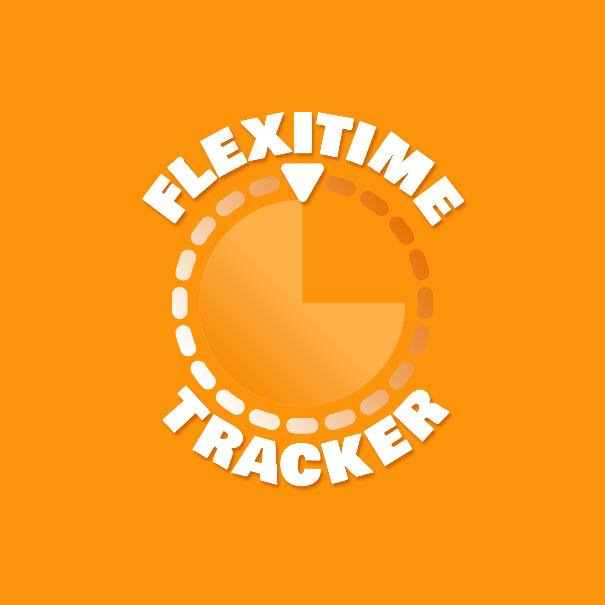
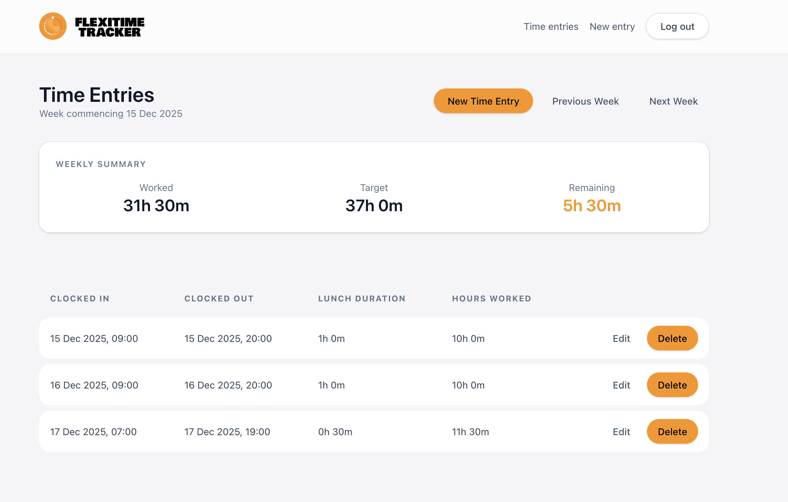
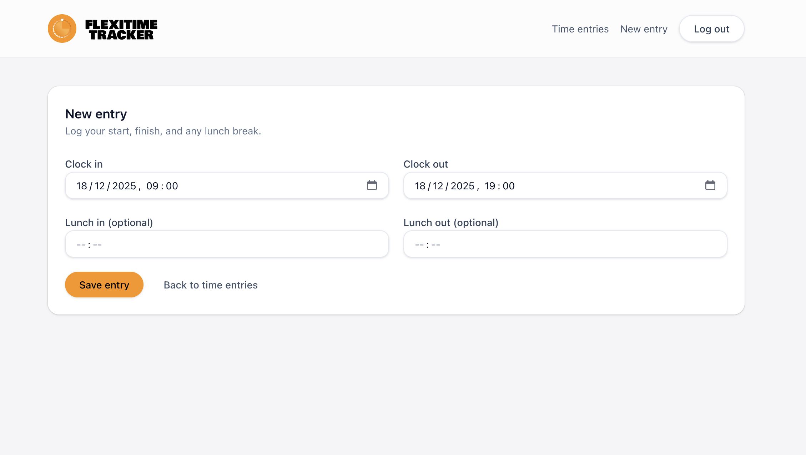

<p align="center">
  
</p>

# Flexitime


Flexitime is a small Rails app for tracking clock-in/clock-out time, lunch
breaks, and weekly hour balances.

It's designed around compressed working weeks (37 hours by default), with
carry-over between weeks so overtime or shortfalls roll forward automatically.

## Features
- Clock in / clock out with optional lunch breaks
- Weekly totals showing required hours and running balance
- Automatic carry over of credit/debt between weeks
- Configurable contracted hours and working days per user
- Simple personal time tracking workflow (not a full HR system)

## Screenshots

Here's a quick look at the core screens.

### Weekly summary
Shows worked hours, target, and remaining balance, alongside the weekly entries list.
<p align="center">
  
</p>

### New entry screen
Log your start/finish times and optional lunch breaks.
<p align="center">
  
</p>

## Requirements
- Ruby (see `.tool-versions`)
- PostgreSQL

## Setup

```sh
bundle install
bin/rails db:prepare
```

## Run locally

```sh
bin/dev
```

Then visit: http://localhost:3000

## Tests

```sh
bundle exec rspec
```

## Notes
- Weeks start on Monday (Mon-Sun).
- Required hours for the week are adjusted using the previous week's balance.
- Originally built for personal use, and focused on being simple and reliable.
