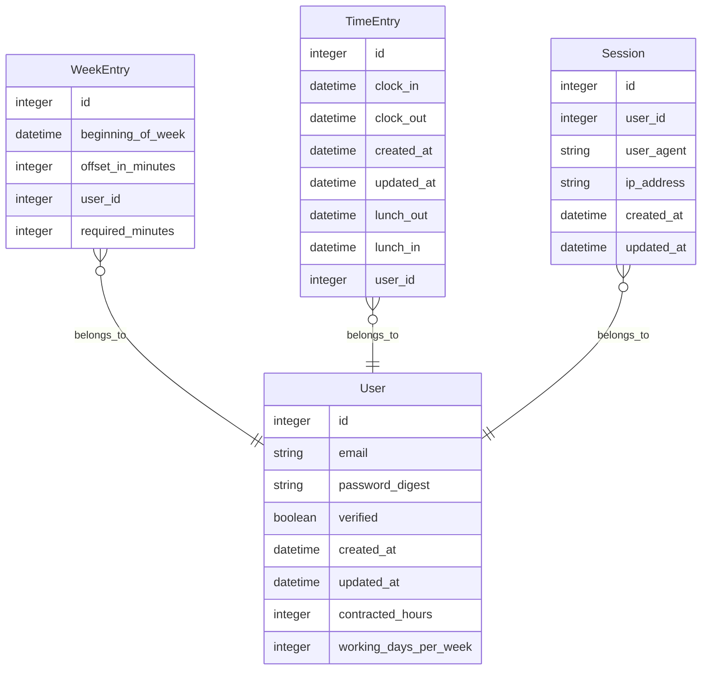

```mermaid
erDiagram
  WeekEntry {
    integer id
    datetime beginning_of_week
    integer offset_in_minutes
    integer user_id
    integer required_minutes
  }
  WeekEntry }o--|| User : belongs_to
  User {
    integer id
    string email
    string password_digest
    boolean verified
    datetime created_at
    datetime updated_at
    integer contracted_hours
    integer working_days_per_week
  }
  TimeEntry {
    integer id
    datetime clock_in
    datetime clock_out
    datetime created_at
    datetime updated_at
    datetime lunch_out
    datetime lunch_in
    integer user_id
  }
  TimeEntry }o--|| User : belongs_to
  Session {
    integer id
    integer user_id
    string user_agent
    string ip_address
    datetime created_at
    datetime updated_at
  }
  Session }o--|| User : belongs_to
```